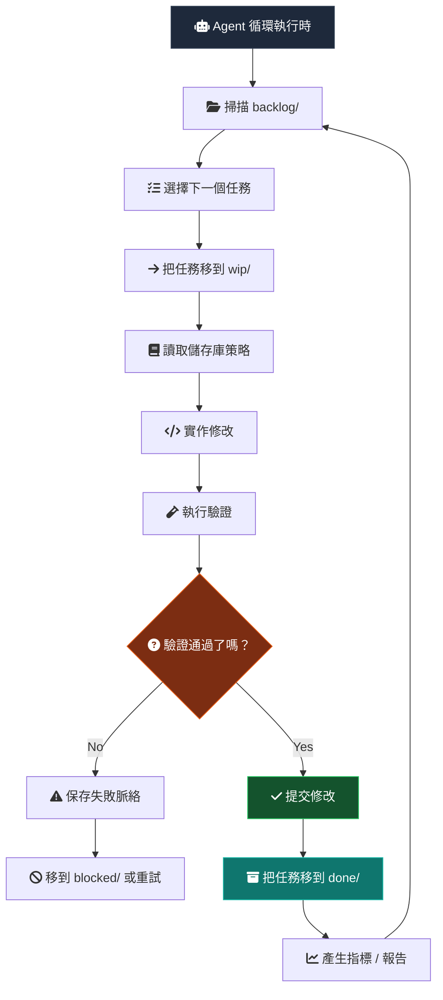
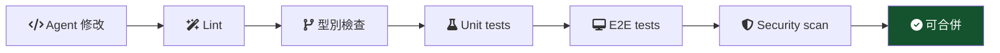
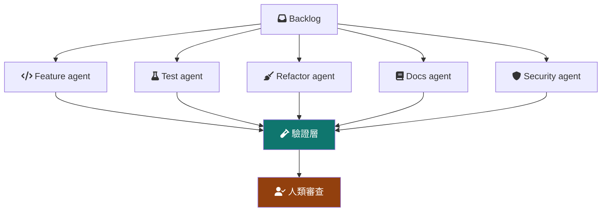
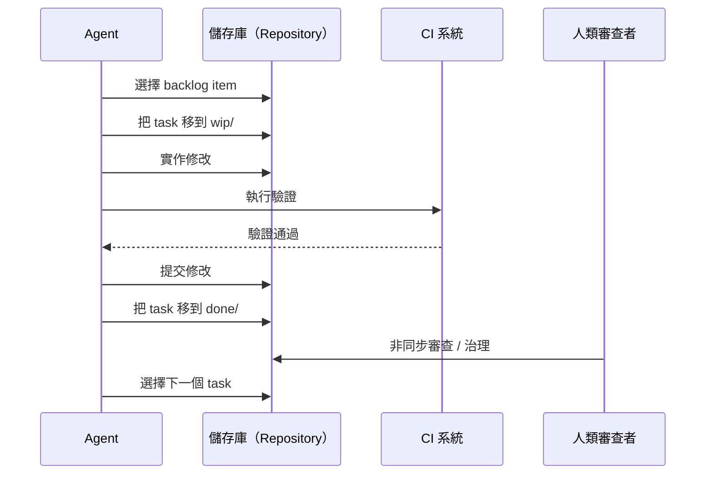

> 如果儲存庫（Repository）本身就是排程器（Scheduler）呢？

現在多數 AI 編碼工作流仍然是會話驅動（session-driven）：

```txt
Human -> Prompt -> Agent -> Stop
```

這很有用，但它把 Agent 當成一次性的聊天參與者。儲存庫也可以被設計成一個持續演化的系統：Agent 從持久佇列（persistent queue）中執行有邊界的工作（bounded work），而人類仍然保留審查者、架構師與治理者的角色。

運行模型（operating model）會更接近：

```txt
Human -> Governance -> Continuous Agent Runtime
```

## 基本架構

儲存庫本身成為編排層（orchestration layer）。

```txt
repo/
├── src/
├── tests/
├── docs/
├── agent/
│   ├── backlog/
│   ├── wip/
│   ├── done/
│   ├── blocked/
│   ├── archive/
│   └── policies/
```

每個工程任務都是一個檔案：

```txt
agent/backlog/add-search-unit-tests.md
agent/backlog/remove-legacy-api-client.md
agent/backlog/improve-error-boundaries.md
```

這和看板（Kanban）類似，因為工作項目（work item）會在明確狀態之間移動。差別是 git 會記錄這些狀態轉換，所以佇列本身變得可審查、可復原。

## Agent 執行流程



重點不只是 Agent 能自主運行（autonomous）。重點是 Agent 在人類可以檢查的狀態機（state machine）裡運行。

## 為什麼使用檔案系統看板

很多編排系統最後都會重新發明 git 已經具備的能力。

| 能力 | Git 已經提供 |
| --- | --- |
| Auditability | Commit history |
| Rollback | Git revert |
| Reviewability | Pull requests |
| Ownership | CODEOWNERS |
| Traceability | Commit SHA |
| Replication | Clone/fork |
| Automation | CI/CD |
| State transitions | File movement |

所以佇列本身會變成可版本化、可審查、可重現、可觀測、可分支化。

## 任務邊界

任務檔案不應該只有標題。它應該定義 Agent 被允許操作的邊界（boundary）。

```md
# Task

Improve order page loading skeleton.

# Goal

Reduce perceived loading delay and improve CLS stability.

# Constraints

- No layout shift after hydration
- Must support static export
- Avoid client-only rendering

# Validation

bun run test
bun run typecheck
bun run build

# Ownership

frontend-platform

# Priority

P2
```

這樣 Agent 會得到有邊界的執行面（bounded execution surface），審查者也會得到一個容易審計的緊湊契約（compact contract）。

## 不阻塞執行時的人類審計

真正困難的問題不是 Agent 能不能持續工作，而是人類如何繼續參與，同時不變成執行時瓶頸（runtime bottleneck）。

答案是把人類責任轉向策略、審查和例外處理（exception handling）。


| 角色 | 責任 |
| --- | --- |
| 架構師 | 定義邊界 |
| 審查者 | 審計修改 |
| 治理者 | 控制策略 |
| 優先級負責人 | 提供 backlog |
| 事件處理者 | 處理阻塞狀態 |

循環可以繼續運行，但規則控制權仍然在人類手中。

## 驗證才是執行時控制器

Agent 是機率性的（probabilistic）。驗證是確定性的（deterministic）。

系統應該把信任從這裡移開：

```txt
trusting the agent
```

轉向這裡：

```txt
trusting the validation system
```



工程品質真正存在於檢查、契約、可審查的差異和回滾路徑（rollback path）裡。

## 自我增長的品質

一個有用的湧現性質（emergent property）是，儲存庫可以透過小型排隊任務逐漸改善自己。

| 分類 | 例子 |
| --- | --- |
| 測試 | 增加缺失的 edge-case tests |
| 重構 | 刪除 dead abstractions |
| 型別 | 強化 type safety |
| 效能 | 降低 bundle size |
| 可靠性 | 改善 retry logic |
| DX | 改善 CI feedback |
| 可觀測性 | 增加缺失的 tracing |
| 文件 | 保持 docs 同步 |

這更像複利（compound interest），而不是傳統專案交付。價值來自許多已經驗證的小型改進（micro-improvements），而不是一次大型 rewrite。

## 多 Agent 拓撲

隨著時間推移，專業化（specialization）會自然出現。



一開始拓撲應該保持簡單。一個帶嚴格佇列的單一工作器，比一組 Agent（swarm）更容易治理。只有當驗證、所有權和審查容量足夠強時，專業化才真正有用。

## 失敗模式

這個系統不是魔法。自主性（autonomy）會提高吞吐量（throughput），也會放大錯誤。

| 風險 | 說明 |
| --- | --- |
| 無限循環 | Agent 反覆編輯同一批檔案 |
| 驗證博弈 | 工作只最佳化 CI pass |
| 儲存庫噪音 | commit 很頻繁但價值很低 |
| 脈絡漂移 | Agent 誤解架構意圖 |
| 成本爆炸 | token 和 runner usage 失控 |
| PR 過載 | 審查者無法吸收差異量 |
| 虛假生產力 | product value 沒增加，activity 卻增加 |

自主性越強，治理就越重要。

## 最小原型堆疊

| 層 | 候選 |
| --- | --- |
| 佇列 | Filesystem Kanban |
| 執行時 | Claude Code / Codex / OpenAI Agents |
| 驗證 | GitHub Actions |
| 狀態 | Git commits |
| 治理 | CODEOWNERS and branch rules |
| 指標 | OpenTelemetry, ELK, Datadog, or Sentry |
| 隔離 | Containerized runner |
| 排程 | Cron or CI scheduler |

第一個原型不需要複雜的控制面（control plane）。它需要小佇列、有邊界的工作器、確定性的檢查，以及清楚規定人類何時審查或停止循環的規則。



## Related work

有幾個相近方向的專案和論文。GitHub 的 [Agentic Workflows](https://github.com/github/gh-aw) 在嘗試可由 Agent 執行的工作定義（work definitions）。GitHub Next 的 [Discovery Agent](https://githubnext.com/projects/discovery-agent/) 探索理解儲存庫的 Agent（repository-aware agent）如何調查程式碼庫。Microsoft Research 關於 [YoloFS](https://www.microsoft.com/en-us/research/publication/dont-let-ai-agents-yolo-your-files-shifting-information-and-control-to-filesystems-for-agent-safety-and-autonomy/) 的研究認為，檔案系統設計可以把資訊與控制移向更安全的 Agent 自主性。

風險也開始在研究中變得清楚。[Failed agentic pull requests](https://arxiv.org/abs/2601.15195) 研究了自主編碼嘗試在實踐中如何失敗。[TDFlow](https://arxiv.org/abs/2510.23761) 把 Agent 式工作放在 test-driven feedback loop 中理解。關於工作流可視化和 WIP 控制，官方 [Kanban Guide](https://kanban.university/kanban-guide/) 是有用背景。[Backlog](https://backlog.so/) 也是把本地檔案用作 Agent 友好任務編排面的相近例子。

## Final thought

最大的 unlock 也許不是更聰明的 model。

它可能是這樣的 repository design：當人類 offline 時，autonomous engineering work 仍然可以安全繼續。

這會把軟體工程從人類觸發的執行（human-triggered execution）變成受策略約束的持續演化（policy-constrained continuous evolution）。
