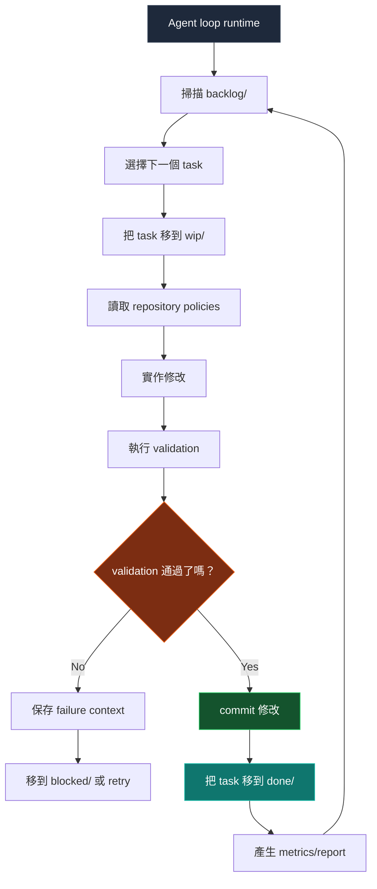
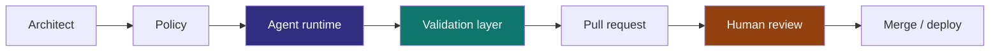
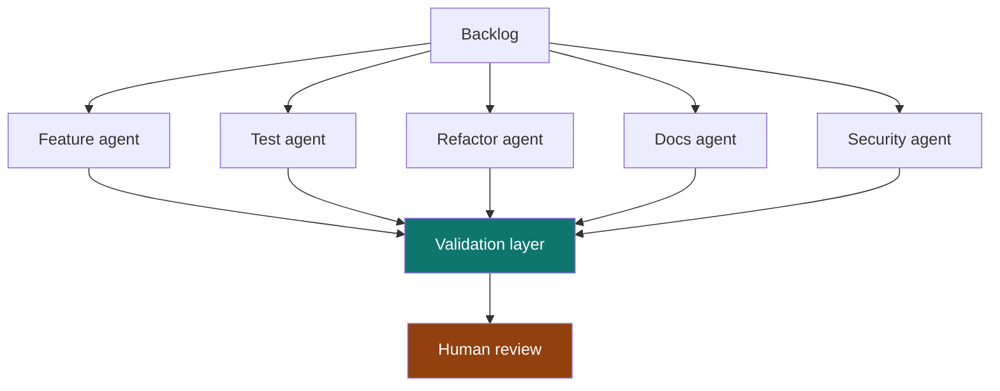
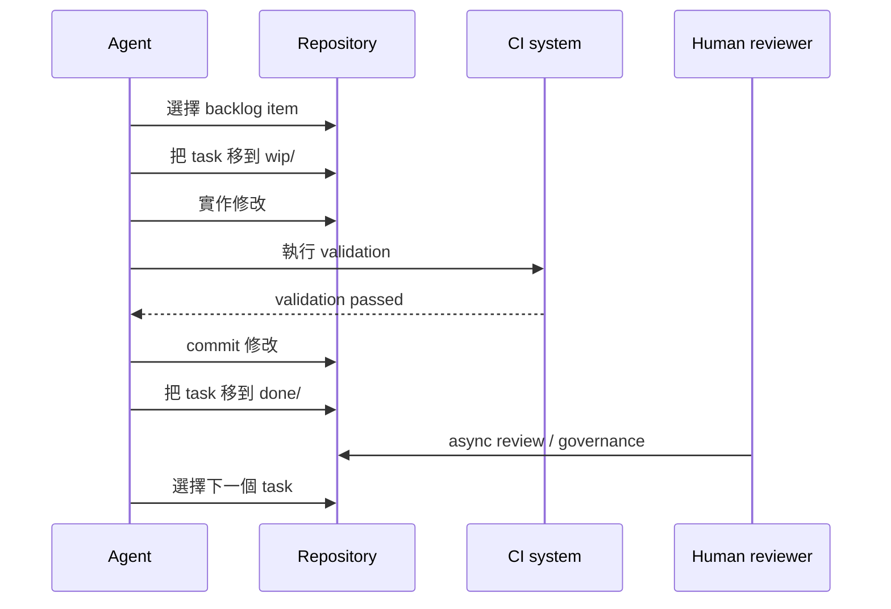

> 如果 Repository 本身就是 Scheduler 呢？

現在多數 AI Coding Workflow 仍然是 session-driven：

```txt
Human -> Prompt -> Agent -> Stop
```

這很有用，但它把 Agent 當成一次性的 chat participant。Repository 也可以被設計成一個持續演化的 system：Agent 從 persistent queue 中執行 bounded work，而人類仍然保留 reviewer、architect 與 governor 的角色。

Operating model 會更接近：

```txt
Human -> Governance -> Continuous Agent Runtime
```

## Core architecture

Repository 本身成為 orchestration layer。

```txt
repo/
├── src/
├── tests/
├── docs/
├── agent/
│   ├── backlog/
│   ├── wip/
│   ├── done/
│   ├── blocked/
│   ├── archive/
│   └── policies/
```

每個 engineering task 都是一個 file：

```txt
agent/backlog/add-search-unit-tests.md
agent/backlog/remove-legacy-api-client.md
agent/backlog/improve-error-boundaries.md
```

這和 Kanban 類似，因為 work item 會在明確狀態之間移動。差別是 git 會記錄這些狀態轉換，所以 queue 本身變得可 review、可復原。

## Agent runtime flow



重點不只是 Agent 能 autonomous。重點是 Agent 在人類可以 inspection 的 state machine 裡運行。

## 為什麼使用 filesystem Kanban

很多 orchestration system 最後都會重新發明 git 已經具備的能力。

| Capability | Git 已經提供 |
| --- | --- |
| Auditability | Commit history |
| Rollback | Git revert |
| Reviewability | Pull requests |
| Ownership | CODEOWNERS |
| Traceability | Commit SHA |
| Replication | Clone/fork |
| Automation | CI/CD |
| State transitions | File movement |

所以 queue 本身會變成 versioned、reviewable、reproducible、observable、branchable。

## Task boundaries

Task file 不應該只有標題。它應該定義 Agent 被允許操作的 boundary。

```md
# Task

Improve order page loading skeleton.

# Goal

Reduce perceived loading delay and improve CLS stability.

# Constraints

- No layout shift after hydration
- Must support static export
- Avoid client-only rendering

# Validation

bun run test
bun run typecheck
bun run build

# Ownership

frontend-platform

# Priority

P2
```

這樣 Agent 會得到 bounded execution surface，reviewer 也會得到一個容易審計的 compact contract。

## Human-auditable without blocking runtime

真正困難的問題不是 Agent 能不能持續工作，而是人類如何繼續參與，同時不變成 runtime bottleneck。

答案是把人類 responsibility 轉向 policy、review 和 exception handling。



| Role | Responsibility |
| --- | --- |
| Architect | 定義 boundary |
| Reviewer | audit 修改 |
| Governor | 控制 policy |
| Prioritizer | 提供 backlog |
| Incident resolver | 處理 blocked state |

Loop 可以繼續運行，但規則控制權仍然在人類手中。

## Validation 才是 runtime controller

Agent 是 probabilistic。Validation 是 deterministic。

System 應該把 trust 從這裡移開：

```txt
trusting the agent
```

轉向這裡：

```txt
trusting the validation system
```


Engineering quality 真正存在於 checks、contracts、reviewable diffs 和 rollback paths 裡。

## Self-growing quality

一個有用的 emergent property 是，Repository 可以透過小型 queued task 逐漸改善自己。

| Category | Example |
| --- | --- |
| Testing | 增加缺失的 edge-case tests |
| Refactoring | 刪除 dead abstractions |
| Types | 強化 type safety |
| Performance | 降低 bundle size |
| Reliability | 改善 retry logic |
| DX | 改善 CI feedback |
| Observability | 增加缺失的 tracing |
| Docs | 保持 docs 同步 |

這更像 compound interest，而不是傳統 project delivery。價值來自許多 validated micro-improvements，而不是一次大型 rewrite。

## Multi-agent topology

隨著時間推移，specialization 會自然出現。



一開始 topology 應該保持無聊。一個帶嚴格 queue 的 single worker 比 swarm 更容易治理。只有當 validation、ownership 和 review capacity 足夠強時，specialization 才真正有用。

## Failure modes

這個 system 不是魔法。Autonomy 會提高 throughput，也會放大 mistake。

| Risk | Description |
| --- | --- |
| Infinite loops | Agent 反覆編輯同一批 file |
| Validation gaming | 工作只最佳化 CI pass |
| Repo churn | commit 很頻繁但 value 很低 |
| Context drift | Agent 誤解 architecture intent |
| Cost explosion | token 和 runner usage 失控 |
| PR overload | reviewer 無法吸收 diff volume |
| False productivity | activity 增加但 product value 沒增加 |

Autonomy 越強，governance 就越重要。

## Minimal prototype stack

| Layer | Suggested choice |
| --- | --- |
| Queue | Filesystem Kanban |
| Runtime | Claude Code / Codex / OpenAI Agents |
| Validation | GitHub Actions |
| State | Git commits |
| Governance | CODEOWNERS and branch rules |
| Metrics | OpenTelemetry, ELK, Datadog, or Sentry |
| Isolation | Containerized runner |
| Scheduling | Cron or CI scheduler |

第一個 prototype 不需要複雜的 control plane。它需要 small queue、bounded worker、deterministic checks，以及清楚規定人類何時 review 或 stop loop 的規則。



## Related work

有幾個相近方向的 project 和 paper。GitHub 的 [Agentic Workflows](https://github.com/github/gh-aw) 在嘗試可由 agent 執行的 work definitions。GitHub Next 的 [Discovery Agent](https://githubnext.com/projects/discovery-agent/) 探索 repository-aware agent 如何調查 codebase。Microsoft Research 關於 [YoloFS](https://www.microsoft.com/en-us/research/publication/dont-let-ai-agents-yolo-your-files-shifting-information-and-control-to-filesystems-for-agent-safety-and-autonomy/) 的研究認為，filesystem design 可以把 information 與 control 移向更安全的 agent autonomy。

風險也開始在研究中變得清楚。[Failed agentic pull requests](https://arxiv.org/abs/2601.15195) 研究了 autonomous coding attempt 在實踐中如何失敗。[TDFlow](https://arxiv.org/abs/2510.23761) 把 agentic work 放在 test-driven feedback loop 中理解。關於 workflow visualization 和 WIP control，official [Kanban Guide](https://kanban.university/kanban-guide/) 是有用背景。[Backlog](https://backlog.so/) 也是把 local files 用作 agent-friendly task orchestration surface 的相近例子。

## Final thought

最大的 unlock 也許不是更聰明的 model。

它可能是這樣的 repository design：當人類 offline 時，autonomous engineering work 仍然可以安全繼續。

這會把 software engineering 從 human-triggered execution 變成 policy-constrained continuous evolution。
