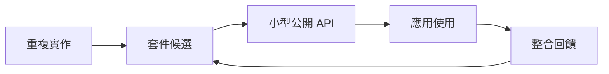
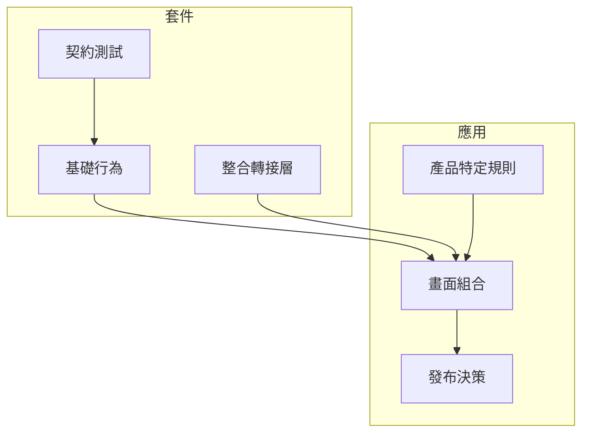

內部 package 的槓桿，來自移除重複工作，而不是讓每個應用都依賴一個隱藏流程。

## Lab 問題

什麼是最小的 shared package system，能讓前端團隊取得槓桿，又不會讓每個應用都變成 dependency-management project？

這是一個 lab 問題，因為答案不只是「抽出 common code」。有趣的部分是邊界：哪些決定應該成為 shared primitive，哪些決定應該留在產品應用裡，以及哪些 feedback signal 能證明 package 真的有幫助，而不是增加儀式。

## 實驗設計

這個 lab 從重複工作開始，而不是從架構開始。好的 candidate 很容易辨識：在不同 app 間複製的 authentication wrapper、dashboard 裡重複的 chart normalization、每個 deployment target 都重寫的 environment helper，或因為上一版太靠近某個產品而被重新做的 test utility。

以 2019 年的 frontend stack 來看，package 機制可以是 npm 或 Yarn，registry 可以是 Verdaccio、Nexus、Artifactory 或 hosted package service。Registry 只是 distribution mechanism。真正的設計工作，是判斷 package 是否有穩定 API、可測試的 behavior surface，以及 consumer 能理解的 versioning story。

## 邊界草圖

Package 應該擁有無聊、可重複的行為：formatting、validation、request conventions、chart setup、logging shape 或 browser compatibility helpers。Application 應該擁有產品決定：workflow order、permission meaning、copy、screen composition 與 release timing。

這個切分讓 shared code 有用但不神秘。Consumer 可以升級 package，因為 API 小、changelog 可讀、semantic version 說清楚接受的是哪一種風險。Package author 可以改善 internals，因為 contract 被測試保護。

## 這個 lab 想證明什麼

目標不是最大化 shared code。目標是減少重複決定。

如果 package 有效，一個新的 application 應該需要更少 setup 就能達到一致 baseline。Chart 應該在不需要每個團隊記得同一批 options 的情況下，看起來與行為都一致。Request helper 應該用可辨識的方式失敗。Test utility 應該讓預期行為更容易被表達。

這個 lab 的有用輸出，是一條 rule of thumb：

> 只有當團隊能命名行為、測試 contract，並說明 consumer 如何從壞版本復原時，才抽出那個決定。

這比「我們複製了兩次」更嚴格。它把 internal package 視為給其他工程師使用的產品介面，而不只是放 shared files 的地方。
