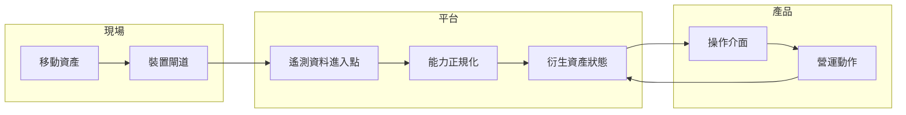

移動資產的雲端介面，不能把位置、連線與裝置狀態當成穩定事實；它們更像是帶有時間與信心程度的輸入。

## 系統邊界

## 開發考量

這類介面最常見的錯誤，是把資產當成資料庫裡的一筆資料。移動資產有位置，但位置有新鮮度。它有裝置狀態，但狀態可能來自 heartbeat、延遲批次或最後一次收到的訊息。它有網路路徑，但使用者最需要信心時，路徑可能剛好不可用。

這會改變前端模型。UI 應該把資料新鮮度放在數值旁邊，而不是藏在 tooltip。它也應該區分「未知」、「過期」、「離線」與「尚未設定」，而不是全部收斂成一般錯誤。這些標籤是產品設計，也是前端、後端與遙測管線之間的技術契約。

實作上，我會用衍生 view model 來表達移動資產，而不是直接把原始裝置 payload 綁到 component。原始 payload 可以保留傳輸層細節；view model 則提供 UI 穩定欄位：識別、最後觀測位置、最後觀測時間、連線狀態、分類與可用動作。這樣 rendering code 不需要理解太多裝置協定。

| 關注點 | 開發含意 |
| --- | --- |
| 位置持續變動 | 顯示新鮮度與信心，而不只是座標。 |
| 連線不穩定 | 把缺少更新視為一級狀態。 |
| 裝置家族不同 | 在 component 層之前先正規化能力。 |
| 操作者需要快速掃描 | 優先處理狀態階層，而不是裝飾細節。 |

## 可延續的模式

以 2016 年左右的 web stack 來看，這可以用 REST endpoint、Rails JSON API、Knockout view model、Angular component，或 polling 與 WebSocket 的混合來實作。工具選擇重要，但更重要的是契約：每個移動資產介面都需要一套描述不確定性的語彙。有了那套語彙，系統才能告訴使用者它知道什麼、不知道什麼，以及哪些操作仍然安全。
