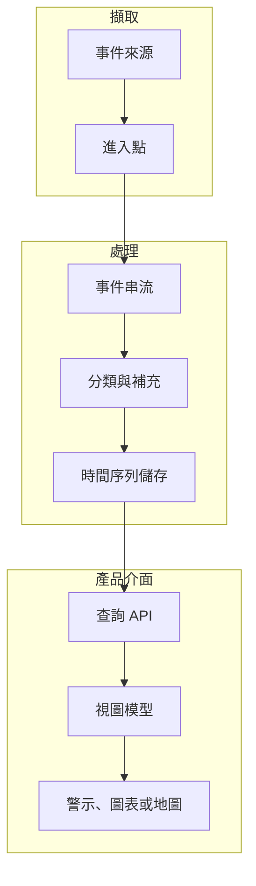

當介面依賴「發生了什麼、何時發生、系統能否解釋」時，事件管線就成為使用者體驗的一部分。

## 管線形狀

## 開發考量

當介面依賴事件順序、新鮮度與詮釋時，事件資料就會變成使用者體驗。圖表、alert list 或 map marker 不是單純 render data；它是在提出一個主張：某件事發生了，而且系統理解到足以把它呈現出來。

開發上的挑戰通常落在原始事件保真度與產品可用性之間。Raw event stream 保留對 debug 與分析有用的細節，但使用者介面需要穩定語意：事件類型、觀測時間、受影響資產、嚴重度、信心程度，以及是否可操作。這個 mapping 應該被明確設計，而不是散落在 component logic 裡。

當前端透過 API 查詢 time-series 或 event data 時，查詢契約會影響信任。Pagination、time range、deduplication、timezone handling 與 null field 都會改變使用者對系統的判斷。如果 UI 靜默丟掉格式不完整的事件，使用者看到的是「沒有」。如果 UI 顯示所有 raw edge case，使用者看到的是噪音。產品需要一層把事件資料轉成可理解狀態的中介。

| 管線層 | UX 責任 |
| --- | --- |
| Ingestion | 保留足夠來源細節，以便 debug 遺失或延遲事件。 |
| Stream processing | 附上穩定的事件語意與嚴重度。 |
| Storage/query | 讓時間窗與篩選行為可預期。 |
| UI rendering | 解釋新鮮度、空狀態與可操作性。 |

## 可延續的模式

到 2018 年，營運型產品常會組合 stream processing、Kafka-style event transport、Druid 或 Elasticsearch 這類分析查詢，以及用 Chart.js、D3 或自訂地圖視圖做出的 dashboard。可重複的重點是：事件管線不是純後端基礎設施。它決定前端能否對營運現實提出可信的說法。
