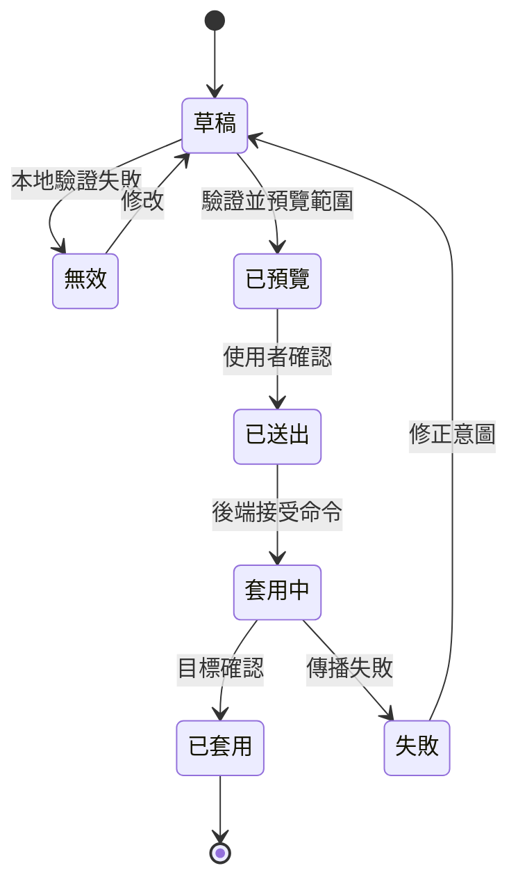

分散式系統的設定介面，需要先讓變更變得可理解，再讓變更變得容易。

## 設定生命週期

## 開發考量

設定介面有風險，因為它把人的意圖轉成分散式行為。一個按鈕可能改變裝置回報方式、alert 觸發方式，或誰會收到營運訊息。介面不能把這件事當成一般 form submission。

主要開發考量是讓 scope 可見。套用變更之前，使用者需要知道哪些物件會受影響、哪些規則正在改變、必要欄位是否完整，以及系統接下來會做什麼。UI 應該根據變更後果提供 validation、preview 與 confirmation，而不只是根據表單形狀。

實作上，這通常適合 draft model。UI 編輯 local draft，對 typed contract 做 validation，預覽受影響 target，然後才送出 command。送出後，UI 不應該立刻暗示成功，除非後端已確認 propagation，或至少已接受 job。在分散式系統裡，「saved」與「applied」是不同狀態。

| UI 狀態 | 意義 |
| --- | --- |
| Draft | 使用者正在編輯尚未影響系統的意圖。 |
| Validated | 系統能理解這次變更請求。 |
| Submitted | 變更請求已被接受處理。 |
| Applied | 受影響 target 已觀測或確認變更。 |
| Failed | 系統能解釋變更停在哪裡。 |

## 可延續的模式

無論 stack 是 Rails、Node.js、Java service，或 API 後面接 message queue，有用的模式都一樣：把 editing 與 applying 分開。設定介面應該把 draft、validation、submission、propagation 與 observation 建模成不同產品狀態，因為使用者感受到的也是不同狀態。
