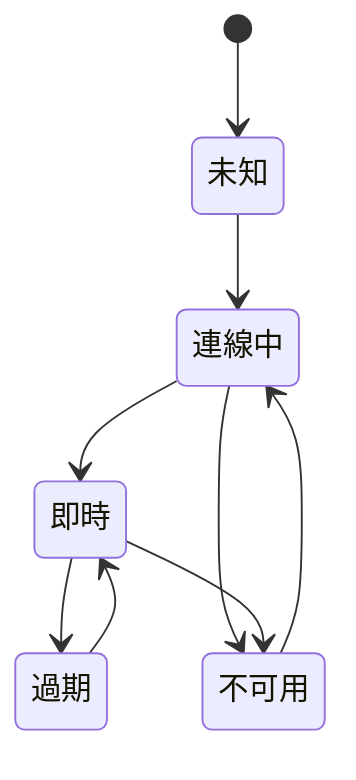

靠近硬體的前端工作，必須呈現現實，但不能假裝瀏覽器控制了現實。

## 邊界假設

| 前端假設 | 硬體與網路現實 |
| --- | --- |
| 資料會照 request 順序抵達。 | 裝置資料可能延遲、缺失或重播。 |
| 錯誤是應用程式狀態。 | 錯誤可能來自覆蓋缺口、電源或物理條件。 |
| Refresh 是無害的。 | Refresh 可能掩蓋 state machine 或 stream setup 問題。 |
| UI state 是 local 的。 | UI state 常反映仍在收斂的遠端系統。 |

## 開發考量

硬體相鄰的前端工作，迫使瀏覽器代表它無法控制的系統。UI 可以要求 stream、畫 map marker 或送出 configuration，但它無法保證無線覆蓋、裝置電源、sensor health 或 clock accuracy。

這應該改變 component 設計方式。UI 需要明確的不確定性，而不是樂觀假設。Map marker 可以有 last-known time。Camera tile 可以分開 stream setup 與 media availability。Sensor reading 可以顯示 fresh、stale 或 outside expected range。這些不是裝飾標籤，而是產品說實話的方式。

開發架構應該避免把 hardware condition 分散到許多 component。比較好的形狀，是把 raw device 與 network signal 正規化成一小組 UI state。Component 一致地 render 這些 state，測試也可以覆蓋 state matrix，而不需要重建整個外部系統。

## 狀態模型草圖

## 可延續的模式

工程姿態很簡單：靠近硬體的前端程式碼應該謙遜、明確、可觀測。無論 UI 是 Angular、React、Knockout 或 plain JavaScript，瀏覽器都不應該假裝自己比裝置、網路與 stream pipeline 擁有更強保證。
