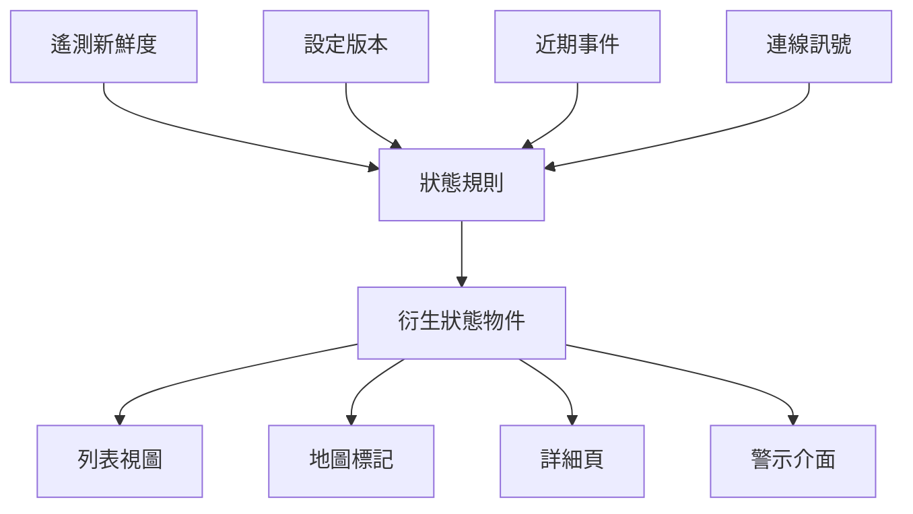

當人們用裝置狀態來決定要信任什麼、檢查什麼、下一步改什麼，它就成為產品介面。

## 狀態推導

## 開發考量

裝置狀態是一層詮釋。後端可能知道很多事：last message time、firmware version、connectivity result、configuration version、location 與 recent events。使用者需要的是更小的答案：這個裝置健康嗎、是否需要注意、接下來能做什麼？

產品介面位在這兩個世界中間。它要在重要的地方保留技術細節，但不應該強迫每個操作者檢查 raw telemetry。這通常代表要用清楚規則建立 derived status，並讓規則足夠可見，讓使用者信任結果。

對前端開發來說，重要 artifact 是 status contract。Component 應該收到包含 label、severity、freshness、explanation 與 available actions 的 status object。這個 contract 讓 list、detail page、map 與 alert 可以一致渲染。

| 狀態欄位 | 為什麼重要 |
| --- | --- |
| Label | 給使用者可快速掃描的狀態。 |
| Severity | 幫助排定注意優先順序。 |
| Freshness | 避免過期資料看起來像現在狀態。 |
| Explanation | 讓衍生狀態可被理解。 |
| Available actions | 把狀態連到營運下一步。 |

## 可延續的模式

Status 是產品 API，不只是資料庫 projection。Time-series store、cache、search index 與 stream processor 都可以餵入狀態，但 user-facing contract 應該保持穩定：正在發生什麼、訊號有多新、系統為什麼這樣判斷、接下來能做什麼。
