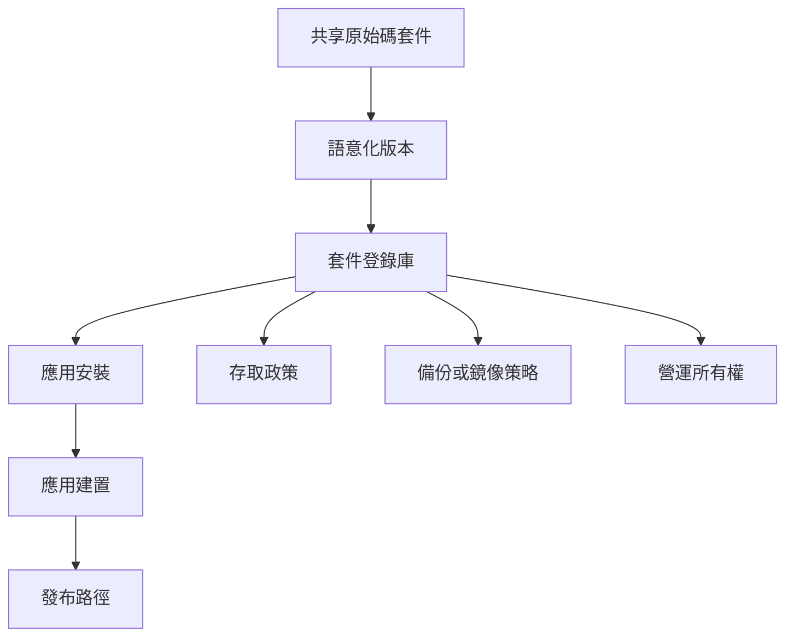

私有 package registry 一開始像是開發便利工具；一旦產品 build 離不開它，它就成為基礎設施。

## 依賴拓樸

## 開發考量

私有 package registry 常從效率工具開始。團隊把 authentication helper、UI utility、chart wrapper 或 environment glue 抽成 shared package，讓應用可以更快前進。當 production build 依賴那個 registry，它就變成 infrastructure。

這個轉變會改變工程要求。Access 需要文件化。Ownership 需要清楚。當有人換機器、換網路或換部署環境，build 仍需要可重現。Package publishing 需要 versioning discipline，避免一個團隊不小心破壞另一個團隊。

前端關注的不只是安裝。Shared package 會形塑 application architecture。如果 package 擁有太多產品行為，每個 consuming app 都繼承 hidden coupling。如果它擁有太少，又會變成只有 release overhead 的薄 wrapper。比較有用的邊界，通常是 API 小而穩定、相容性期待清楚的 utility 或 primitive。

## Registry 作為基礎設施

| Infrastructure concern | Package registry 對應問題 |
| --- | --- |
| Availability | 應用需要 build 時，能否安裝 dependency？ |
| Access control | 正確的人與系統能否讀取或發布 package？ |
| Disaster recovery | Registry 不可用時，package 能否 restore 或 mirror？ |
| Observability | 團隊能否快速辨識 publish、install 與 version 問題？ |

## 可延續的模式

npm、Yarn、Verdaccio、Artifactory、Nexus 與 cloud-hosted registries 都讓 package sharing 看起來很日常，但 operating model 仍然重要。當 release 依賴它時，開發便利就變成產品基礎設施。
