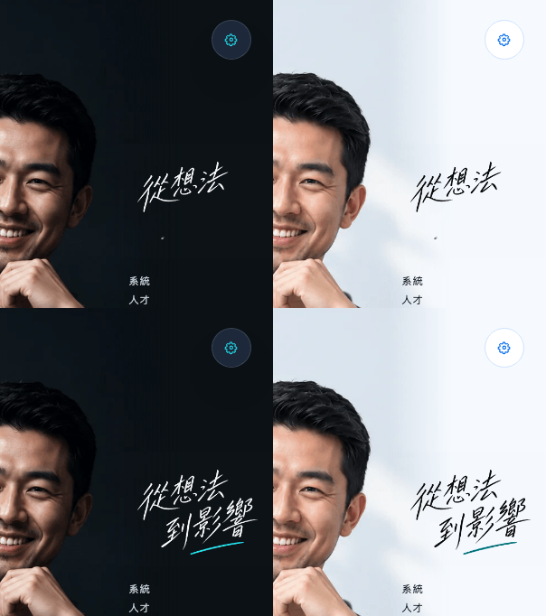
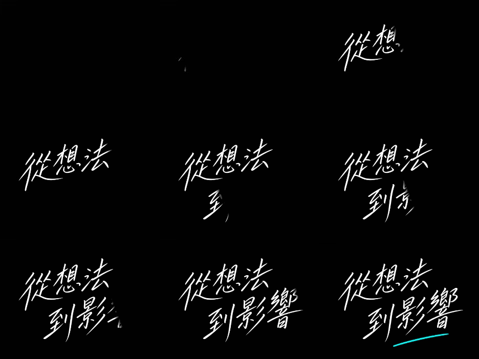

# Chinese hero tagline animation — 2026-09-22

Both Chinese locales now animate their handwritten hero tagline the way English
does. `zh-tw` and `zh-cn` share `hero/tagline.zh.webm`, exactly as they already
share the still `hero/tagline.zh.webp` the animation is drawn from. Japanese is
unchanged and still renders its still artwork.

## Screenshots



Chromium, local production export, `zh-tw`, 1440px. Left column dark, right
column light; top row mid-animation, bottom row after the underline lands. Both
themes reveal the same strokes at the same time; only the ink and the blend
differ. No white card appears in light mode — the opaque video ground is blended
out by the tagline group, screen in dark and multiply in light.



Nine frames sampled across the generated 8s video: 從想法 draws left to right,
then 到影響, then the teal underline, then a short hold.

## How the video is made

`scripts/animate-hero-tagline.ts` (`bun run assets:tagline`) opens the existing
still artwork in headless Chromium, finds the baseline angle that most cleanly
separates the two handwritten lines, orders every ink pixel along that baseline,
and reveals them line by line with a soft leading edge. Frames are recorded from
a canvas with `MediaRecorder` as VP9.

The output matches the supplied English video's shape — 312 × 234, 8 seconds, no
alpha channel, white strokes on a near-black ground — so the hero's existing
`playbackRate = 3` and the existing blend need no locale-specific handling. It is
85,512 bytes and is fetched only when the video actually plays: the element keeps
`preload="none"` and its source is assigned after the reduced-motion and codec
checks pass.

## Behaviour and fallbacks

`lib/profile-2026-assets.ts` owns which locales have an animation, so the hero
component no longer special-cases English. Every existing fallback path is
unchanged and now covers Chinese too: reduced motion, unsupported playback,
blocked autoplay, a failed request and no JavaScript all leave the still
handwritten image in place, with the same localized alternative text.

## Verification

- `bun run test`: **166 passed**, 45 files.
- `bun run typecheck`: **passed**.
- `bun run build`: **passed**, 156 static pages exported.
- `bun run lint`: fails only on the pre-existing untracked
  `tmp/experience-review/capture.cjs`, which is outside this change.
  `bunx eslint . --ignore-pattern "tmp/**"`: **passed**.
- `git diff --check`: **passed**.

Browser coverage, **130 passed** in Chromium and Firefox:

```bash
E2E_TARGET=preview E2E_PREVIEW_PORT=4391 bun run test:e2e \
  e2e/profile-2026-light-theme.spec.ts e2e/profile-hero.spec.ts \
  e2e/profile-experience.spec.ts e2e/profile-approach.spec.ts \
  e2e/profile-footer-artwork.spec.ts e2e/profile-2026-projects-footer.spec.ts \
  e2e/profile-versions.spec.ts e2e/theme.spec.ts --workers=4
```

The blend and opacity guard in `e2e/profile-2026-light-theme.spec.ts` now runs for
`en`, `zh-tw` and `zh-cn`; the hero suite asserts a video for every locale except
Japanese. Light/dark layout parity is unaffected and still passes at
390/937/1440px. No deployment or production smoke check was performed.
