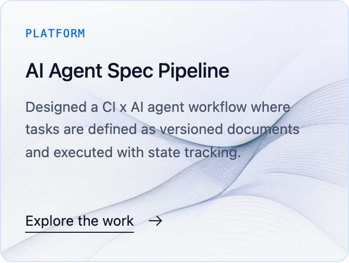

# Profile 2026 accessibility baseline — issue #88

Captured 2026-09-23 against commit `d504b10ab5c14fa7fcb510ce2d8aaba331768b33`.
Tracking: [#88](https://github.com/nelson-o/nelson-o.github.io/issues/88), parent
[#81](https://github.com/nelson-o/nelson-o.github.io/issues/81).
This is the before-change audit #88 asks for. It is not closure of #88 and not
release acceptance. It changes no production code, styles, assets or
dependencies. The findings below are inputs to the approved interaction designs
from #82; none of them has been fixed here.

## Conditions

- Production static export (`bun run build`) served by `PORT=4488 bun run preview`.
- Playwright 1.59.1 with Chromium 147, headless, macOS.
- axe-core 4.13.0, injected into the page. It was installed in a scratch
  directory, so no project dependency changed. Tags: `wcag2a`, `wcag2aa`,
  `wcag21a`, `wcag21aa`, `wcag22aa`, `best-practice`.
- Locales: `en`, `zh-tw`, `th`, `de`. These cover Latin, CJK, Thai, and the
  live-text artwork fallback from #98. Themes: light and dark, set through the
  saved preference. Widths: 1280 and 390, plus 320 for reflow and target size.
- Reduced motion was emulated for the automated runs. Hero-animation
  reduced-motion behavior is already covered by `e2e/profile-hero.spec.ts`.

## Automated results

| Check | Result |
| --- | --- |
| axe violations (16 locale/theme/width runs) | **0** in every run |
| axe `incomplete` | Only `color-contrast`: 28–38 nodes per run, where text sits over images, gradients, or pseudo-elements. Measured manually below. |
| Reflow at 320 px (≈400% zoom of 1280) | No horizontal scroll; also asserted for all eight languages in `e2e/profile-versions.spec.ts` |
| Text spacing (WCAG 1.4.12 override) at 1280 and 320 | No overflow or clipped text. The only "clipped" nodes are the intentionally visually-hidden GitHub/LinkedIn labels. |
| Motion under `prefers-reduced-motion: reduce` | No running CSS animations or transitions longer than 200 ms; `scroll-behavior: auto` |

## Keyboard walkthrough (en, both themes, 1280 and 390)

Tab order, identical at both widths:

1. Skip to content
2. NELSON
3. About, Experience, Projects, Talks, Contact
4. Settings
5. GitHub, LinkedIn
6. Get in touch (hero)
7. Experience ↓
8. View full history
9. Explore the work ×3
10. Talks, Side Projects, Hackathons, Certifications
11. GitHub, LinkedIn (contact)
12. Get in touch (contact)
13. NELSON (footer)
14. Explore the site

- Every stop is visible and shows a 2px solid outline with a 5px offset:
  `rgb(0 105 238)` in light, `rgb(128 206 245)` in dark.
- The skip link moves focus to `main` without ringing the landmark (#96).
- The closed settings panel is not focusable (`visibility: hidden`). Opening
  it moves focus to the checked theme radio, arrow keys change the theme,
  and Escape closes the panel and returns focus to Settings.
- Disclosures use native `
`, and collapsed content is not focusable.

## Selection, cursor, structure and media

- **`user-select: none`**: not used anywhere on the page, so all readable text
  can be selected and copied.
- **Pointer cursor**: only on links, buttons, summaries and settings labels.
  Static cards and timeline rows use the default cursor.
- **Landmarks**: one each of header, nav ("Primary"), main and footer. Regions
  are labelled: About, Core Strengths, Experience, Selected projects, Contact.
  Two `aside` elements (The approach, Beyond work) are nested inside sections.
- **Images**:
  - The portrait has alt text, and only the active theme's copy is rendered.
  - The tagline image uses the tagline as alt; the stroke-reveal video is `aria-hidden`.
  - Employer marks are decorative (`alt=""` inside `aria-hidden`) beside text employer names.
  - The contact heading image uses the manifesto as alt.
  - Profile-only languages render live text instead of these images.
- **Target size (2.5.8)**: most controls are at least 24×24. Three inline
  links are shorter: Experience ↓ (94×22), footer NELSON (74×18) and Explore
  the site (93×18). All three pass through the spacing exception at 1280, 390
  and 320.

## Contrast over images and gradients

Method: for each element, the text was made transparent, the box was
screenshotted, and the text color was compared against a grid of background
pixels. `p10` is the 10th-percentile ratio. The worst single pixel is often an
art stroke or accent line inside the box, so treat it as a pointer for
inspection, not a verdict.

| Element | Size | Light p10 | Dark p10 | Note |
| --- | ---: | ---: | ---: | --- |
| Project category label | 11px | **4.30–4.37** | 10.3–10.4 | Below 4.5:1 AA in light |
| Project summary | 14px | 4.90–5.59 (worst 1.2) | 7.2–9.2 (worst 1.1) | Dark wave strokes cross the text |
| Hero "Since 2010" | 8–9px | 4.74 (1280) | 6.97 | Passes at p10; very small text |
| Approach motto | 8–8.5px | 8.3 | 8.2–9.9 | Passes; very small text |
| Approach caption | 10px | 5.7–5.8 | 5.3–5.5 | Low worst values come from the accent rule, not the text |
| Hero topics, summary; timeline years; quote; project titles and toggles; stat labels | — | ≥7.3 | ≥7.2 | Pass |

## Findings

Ordered by severity. Each needs the relevant #82 block approval before
implementation, as #81 requires.

1. **Light project category labels fail AA contrast** (WCAG 1.4.3). About
   4.3:1 at 11px normal weight; darken the label or increase the weight or size.
   Block: projects.
2. **Project art crosses body text** (WCAG 1.4.3, local). The wave strokes
   pass behind the summary in both themes, and contrast drops to about 1.1–1.2
   where they cross. Mask or fade the art behind the text column. Block: projects.
3. **Settings stays open when focus leaves it** (WCAG 2.4.11 Focus Not
   Obscured, and the menu-button pattern). Tabbing past the language select
   leaves the panel open over the page while focus moves on. Close the panel
   on focus-out, or keep focus inside it. Owned by #84 (settings move).
4. **Settings button promises a dialog that isn't one** (WCAG 4.1.2).
   `aria-haspopup="dialog"` is set, but the panel has no `role="dialog"` or
   accessible name, and the button has no `aria-controls`. Either give it real
   dialog semantics or treat it as a disclosure (`aria-expanded` +
   `aria-controls`, no `haspopup`). Owned by #84.
5. **Two "Get in touch" controls go to different places** (WCAG 3.2.4, 2.4.4
   best practice). The hero one jumps to `#contact`; the contact one opens
   LinkedIn. Rename one of them, or point both at the same destination.
   Blocks: hero, contact.
6. **Three identical "Explore the work" summaries.** Each is understandable
   within its card (2.4.4 passes), but a list of controls read out of context
   shows three identical names. Consider including the project name
   (visually hidden). Block: projects.
7. **Capability titles are `h2` under an unheaded region** (1.3.1 best
   practice). "Core Strengths" exists only as `aria-label`, so the outline reads
   H1 → three H2 capability titles → H2 Experience. Consider a visually-hidden
   H2 "Core Strengths" with H3 titles. The approach `aside` has no heading.
   Blocks: capabilities, approach.
8. **Static `<html lang="en">` on every locale** (WCAG 3.1.1, pre-existing).
   The exported `<html>` always declares `en`. The page wrapper already carries
   the right `lang` in the static HTML, and a `beforeInteractive` script fixes
   the root once JavaScript runs, but no-JS clients and crawlers still see `en`
   as the page language. Fixing this needs per-locale root layouts, which is a
   routing change.
9. **Very small text.** Hero "Since" (8–9px), approach motto (8–8.5px), approach
   stat labels (9–9.4px) and hero topics at 390 (9px) meet contrast but are hard
   to read. Not a WCAG failure; flag for design review. Blocks: hero, approach.

## Not covered

- No screen-reader walkthrough (VoiceOver or NVDA), Firefox or WebKit run,
  forced-colors or Windows High Contrast check, or real mobile device.
- Browser text-only zoom at 200% was not checked separately from 320px reflow.
- `ko`, `vi`, `zh-cn` and `ja` were not run through axe here. They share
  components with the audited locales, and all eight have e2e overflow coverage.
- The 2025 edition and non-profile pages are out of scope.

Re-run the same checks after the #82–#87 implementation to produce the
"after" comparison #88 asks for.
