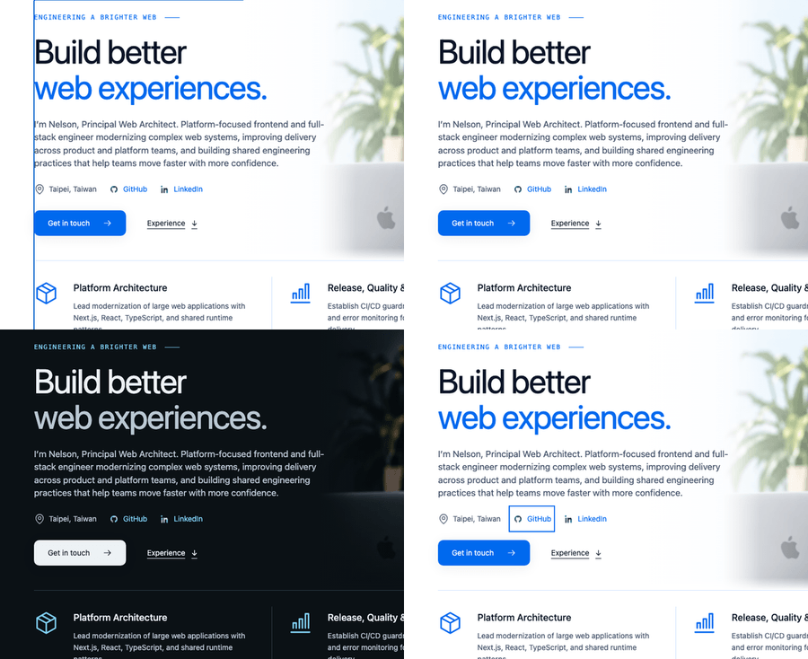

# Skip-link focus outline — 2026-09-22

Activating the 2026 profile's skip link moved focus to `main#main-content`, a
`tabindex="-1"` region. The page styles focus rings for `a`, `summary`, `button`,
`select` and `input` only, so the landmark fell through to Chromium's default
ring — `outline: auto 1px rgb(0, 95, 204)` around a 1312 × 1771px box.



Top left is the previous behaviour in light mode. Top right and bottom left are
the same moment after the fix, light and dark. Bottom right is the next tab stop:
controls inside the landmark keep the page's own 2px accent ring, so focus stays
visible where it identifies a control.

## Change

`components/layout/profile-2026/page.module.css` suppresses the ring on the skip
target only:

```css
.page main[tabindex="-1"]:focus { outline: none; }
```

The region is not a user interface component and is not in the tab order; the
skip link's purpose is served by moving the reading position, which the scroll
and the next tab stop both make evident. Nothing else loses an indicator.

The skip link's own focus style, the landmark's focusability and the existing
`toBeFocused()` assertion are unchanged. Ordinary site pages use a separate shell
whose `<main>` carries no `tabindex`, so they never showed this ring; making that
skip link move focus is a separate question and is untouched here.

## Verification

- `bun run test`: **162 passed**, 45 files.
- `bun run typecheck`: **passed**.
- `bun run build`: **passed**, 156 static pages exported.
- `bunx eslint . --ignore-pattern "tmp/**"`: **passed**. Plain `bun run lint`
  still fails only on the pre-existing untracked `tmp/experience-review/capture.cjs`.
- `git diff --check`: **passed**.

`e2e/profile-versions.spec.ts` now asserts, at 1440px and 390px, that the focused
landmark computes `outline-style: none` and that the next tab stop is inside the
landmark with a 2px solid ring. Full profile/theme browser coverage: **126 passed**
in Chromium and Firefox.
