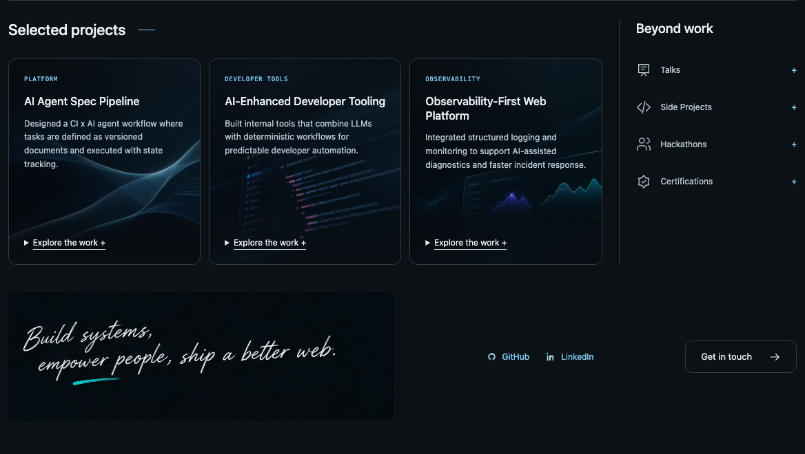
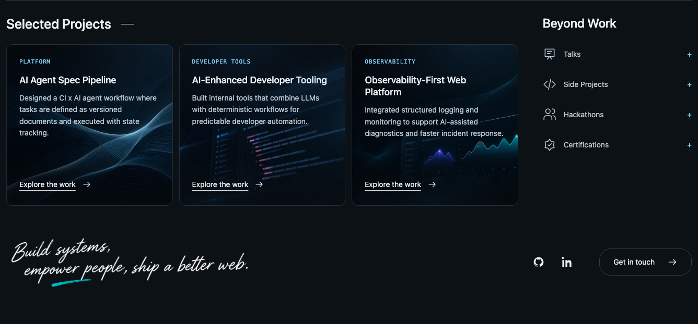
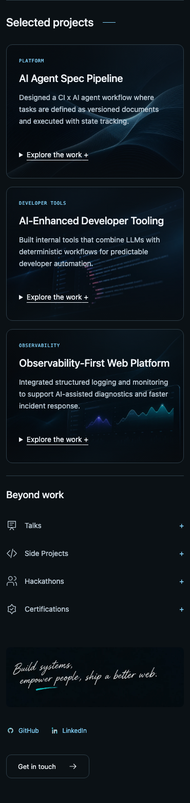
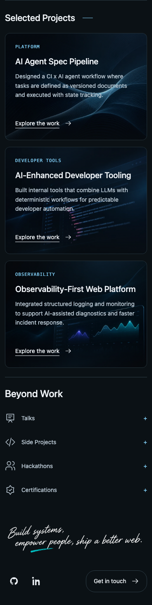

# 2026 projects and footer visual review

Same 1440px and 390px Chromium viewports, dark theme, English route `/en/profile/2026/`, closed disclosures, production static export. Before is commit `7c7b1a9`; after is this PR. Existing uncommitted work in the original checkout is excluded.

| Viewport | Before | After |
| --- | --- | --- |
| Desktop |  |  |
| Mobile |  |  |

The layout uses a wider desktop container, near-square project cards, larger headings/body text, subtler borders, clearer artwork, bottom-aligned disclosure controls, larger activity icons, and a compact footer with icon links and a rounded contact button. Existing copy, project highlights, activity groups, and link destinations remain available. Mockup-only navigation and email destinations are not invented.

Transparent signatures are `public/profile/2026/signature.{en,zh,jp}.webp`. The original assets remain available. Light mode darkens the ink for contrast. All three assets have alpha channels with fully transparent background pixels.

Generated with the built-in imagegen tool, then resized to 1120px and encoded as lossless WebP with Sharp, preserving alpha. English prompt:

> Use case: background-extraction. Edit this footer signature: remove the dark textured background completely and output a PNG with genuine transparent alpha background. Preserve the exact handwritten white lettering, composition, and teal underline. Text verbatim: 'Build systems, empower people, ship a better web.' No new text, no shadows, no panel, no checkerboard painted into the image. Keep wide two-line composition. Save result for use as website footer asset.

Chinese and Japanese prompts:

> Use case: background-extraction. Remove ONLY the dark background of this website footer signature. Output genuine transparent alpha PNG. Preserve every character of the original text exactly, handwritten strokes, white lettering and teal underline, and wide two-line layout. Do not translate, rewrite or add any text. No panel, shadow, or checkerboard.

Inputs were the existing localized footer artwork. Later experimental English variants were discarded after inspecting the selected asset in the browser.
