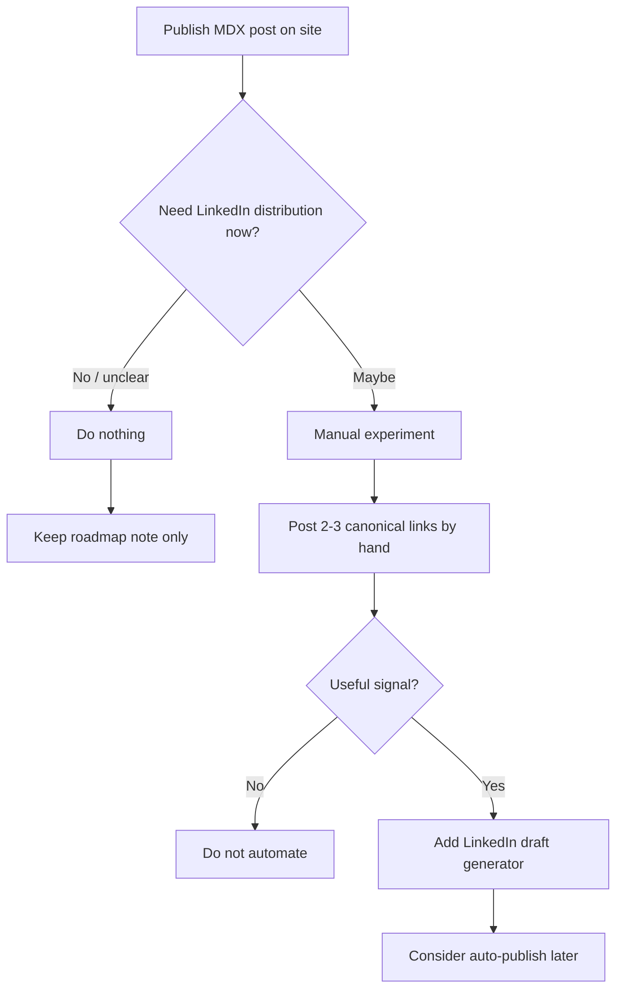

# Social Distribution Roadmap

This document captures a future direction for distributing site posts to developer-facing channels. It is an internal roadmap, not an implementation commitment.

The site should remain a static export. Any distribution automation should run outside the Next.js runtime, most likely through Bun scripts and GitHub Actions. Do not add API routes, server-dependent runtime behavior, or client-side publishing logic to support this work.

## Goals

- Keep MDX posts as the source of truth.
- Make published posts share-ready before investing in channel-specific automation.
- Prefer reviewed draft artifacts before publishing generated content.
- Add platform publishing incrementally through isolated adapters.
- Track what has already been published so automation can be rerun safely.

## Automation Tiers

### Auto-post

These channels can support simple link posts when API access and credentials are available.

- LinkedIn organization posts
- X.com
- Bluesky
- Mastodon, including developer-focused instances such as Fosstodon and Hachyderm

LinkedIn organization posts remain the most practical first automation target if distribution proves valuable. They can be generated from an English MDX entry's title, summary, and canonical URL after production deploy and e2e checks pass.

### Draft Packages

These channels should start with generated draft packages instead of direct publishing. They are sensitive to community tone, platform rules, or manual editorial workflows.

- LinkedIn Articles
- Hacker News
- Lobsters
- Reddit developer communities
- dev.to
- Hashnode
- Medium
- GitHub Discussions
- Discord and Slack developer communities
- Product Hunt, Peerlist, and Indie Hackers when a post ties to a project, tool, or launch

Draft packages should include platform-specific titles, summaries, body copy, tags, target URL, and notes about the intended audience. Generated drafts should be reviewed in a pull request before publication.

### Media Packages

These channels need richer assets and should remain draft-first until the production workflow is mature.

- YouTube Shorts
- TikTok
- YouTube long-form videos
- Twitch or YouTube Live sessions

Media packages can include short scripts, scene lists, captions, thumbnail prompts, titles, descriptions, and source article links. Upload automation should be deferred until credential handling, review flow, rendering, and platform API limits are understood.

## Future Capabilities

- Improve Open Graph, metadata, and social preview quality for canonical site URLs.
- Add a manual distribution checklist for newly published posts.
- Generate platform-specific summaries from MDX frontmatter and article body.
- Publish LinkedIn organization posts after GitHub Pages deployment and production e2e checks pass.
- Generate LinkedIn Article draft packages for manual publishing in LinkedIn's editor.
- Generate X, Bluesky, and Mastodon variants with platform-specific length and tone constraints.
- Generate short-form video scripts, captions, thumbnail prompts, titles, and descriptions.
- Track publish state per platform, including source slug, target URL, external post ID, timestamp, and status.
- Add a review queue so generated distribution artifacts can be approved before publishing.
- Add analytics later for clicks, views, engagement, and repost decisions.

## Guardrails

- Keep the public site compatible with static export.
- Do not add API routes or server-only site runtime behavior.
- Store platform credentials only in GitHub Actions secrets or another external secret store.
- Prefer draft pull requests for generated copy, article drafts, and media packages.
- Avoid blind cross-posting. Developer communities expect channel-specific context and a non-promotional tone.
- Confirm each platform's API access, app approval requirements, quotas, and terms before adding a publishing adapter.
- Make publishing idempotent so reruns do not duplicate posts.

## Validation Before Automation

LinkedIn automation should not be the first implementation step. The more valuable near-term work is making canonical site posts share-ready, then validating whether LinkedIn distribution produces useful signal.



Manual validation should use simple canonical link posts:

```text
Published a new note:

{title}

{summary}

{canonical_url}
```

Treat the experiment as successful only if LinkedIn creates useful conversations, traffic, hiring or collaboration signal, or portfolio value. If it does not, keep the site as the source of record and avoid adding lifecycle machinery for an unproven channel.

## First Implementation Candidate

The first practical step is share-readiness for canonical site posts, not LinkedIn publishing:

1. Verify each published MDX entry has a clear title, summary, canonical URL, and metadata.
2. Improve Open Graph and social preview quality so shared GitHub Pages URLs work well across LinkedIn, X, Slack, Discord, and other channels.
3. Add a lightweight manual distribution checklist for post-publication review.
4. Manually share 2-3 posts on LinkedIn using canonical links.
5. Revisit LinkedIn draft generation or auto-publishing only after the manual experiment proves worthwhile.

Long-form LinkedIn Articles are out of scope for the first workflow. Native long-form Article publishing is an editor-centric workflow rather than a reliable automation target, and converting MDX details such as Mermaid diagrams, code blocks, and media would add complexity before the channel value is proven.

## Manual Distribution Checklist

Use this checklist before posting a canonical article link on LinkedIn or another social channel:

1. Confirm the published post has non-empty `title`, `summary`, and `date` frontmatter.
2. Open the live GitHub Pages URL and verify the canonical path is `/<locale>/<section>/<slug>/`.
3. Check that the page metadata exposes a clear title, description, Open Graph article metadata, and Twitter card data.
4. Copy the canonical link, not a locale-neutral shortcut or draft URL.
5. Share 2-3 canonical links manually on LinkedIn and watch whether the posts create useful signal.
6. Keep a short note on whether the experiment produced traffic, conversations, collaboration leads, or nothing worth automating.
